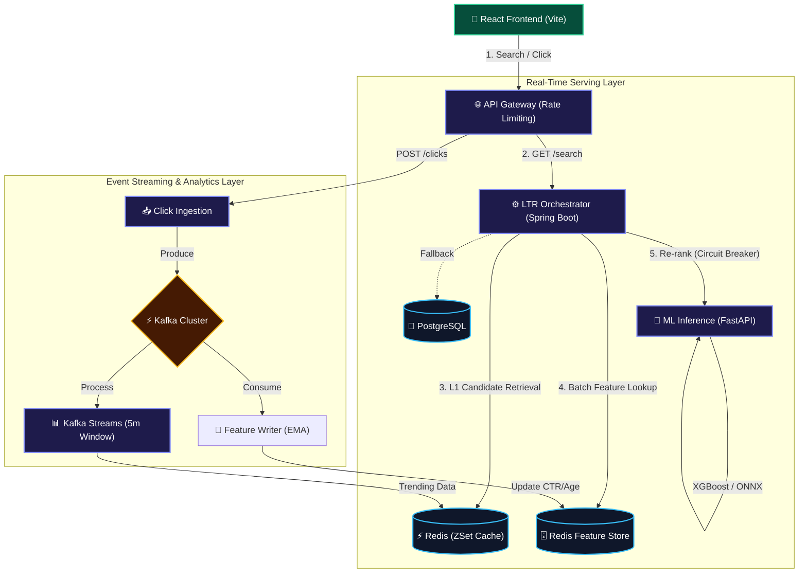

# ClickRank 🚀

## System Design (Architecture)
ClickRank uses a distributed **Two-Stage Learning-to-Rank pipeline** that combines Java microservices, a Python ML engine, and a Kafka streaming ecosystem.

## What the project does
ClickRank is an enterprise-grade, event-driven Learning-to-Rank (LTR) search and recommendation platform. It replaces standard, static database text-searches with a high-performance ML pipeline. By continuously capturing user clickstreams and behaviors in real time, ClickRank dynamically re-orders search results to show the most relevant, highest-converting items first.

## How it works
1) The client sends search and click events through the API Gateway.
2) The LTR Orchestrator retrieves candidates from Redis (with PostgreSQL fallback).
3) It batches feature lookups from the Redis feature store.
4) The ML Inference service re-ranks candidates with the model.
5) Kafka streams update features and trending data continuously.

## Tech stack
- Frontend: React, Vite, TypeScript
- Backend: Java (Spring Boot), Python (FastAPI)
- Streaming: Kafka, Kafka Streams
- Data: Redis (ZSet + feature store), PostgreSQL
- ML: XGBoost, ONNX
- Infra: Docker, Kubernetes, Terraform

## The end result
The system is built to provide ultra-low latency, highly personalized search experiences that scale to FAANG-tier traffic volumes.

**Probable Results & Target SLAs:**
- **Blazing Fast Inference:** Evaluates complex XGBoost feature matrices (CTR, recency, user segments) via highly optimized ONNX binaries to achieve `p95 < 35ms` end-to-end latency.
- **Massive Throughput:** Capable of sustaining **3,000+ QPS** (Queries Per Second) without degradation.
- **Fault-Tolerant by Design:** Guarded by Resilience4j Circuit Breakers. If the ML pipeline crashes or lags, the platform gracefully degrades in milliseconds to fallback ZSet retrieval, ensuring users never see an error page.
- **Premium UX:** Masks any underlying network latency with sleek "Enterprise Dark Mode" UI micro-interactions, providing users with a frictionless, high-end bento-box search experience.
