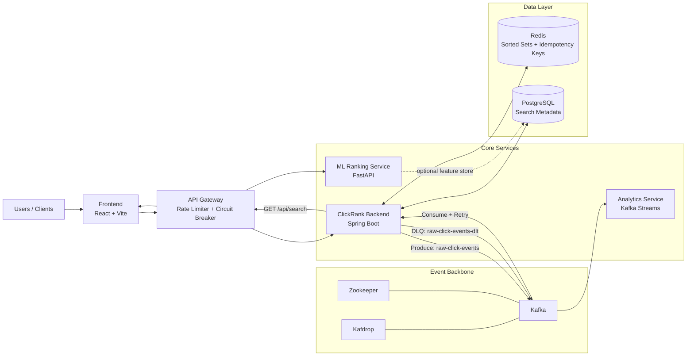

# ClickRank

ClickRank is an event-driven clickstream ranking platform that ingests user interaction events, updates search rankings in real time, and serves low-latency ranked results through a resilient microservice architecture.

## System Design



## What It Does

- Ingests high-throughput click events via REST and Kafka.
- Processes click events asynchronously with event-driven ranking updates.
- Maintains real-time leaderboards using Redis Sorted Sets.
- Serves ranked search results with cache-first reads and database fallback.
- Produces near-real-time trend analytics using Kafka Streams windowed aggregations.
- Exposes an ML ranking endpoint for score enrichment workflows.

## How It Works

1. A click event is submitted to ingestion APIs (`/api/click` or `/api/clicks`).
2. The backend publishes events to Kafka topics (`raw-click-events`, `clickstream-events`).
3. Kafka consumers process events concurrently and update ranking state in Redis.
4. Ranking updates use atomic Redis logic with score decay and increment behavior.
5. Idempotency keys in Redis prevent duplicate processing during retries.
6. Failed consumer attempts are retried and routed to a Dead Letter Topic (`raw-click-events-dlt`).
7. Search requests read top-ranked IDs from Redis and hydrate metadata from PostgreSQL.
8. On cache miss, the service falls back to PostgreSQL to preserve response continuity.

## Service Topology (10 Services)

1. Frontend (React)
2. API Gateway
3. ClickRank Backend
4. Analytics Service
5. ML Ranking Service
6. Kafka
7. Zookeeper
8. Redis
9. PostgreSQL
10. Kafdrop

## Reliability and Performance Patterns

- Event-driven decoupling with Kafka producer/consumer boundaries.
- Consumer retries with exponential backoff and DLQ isolation.
- Idempotent event handling using Redis `SETNX`-style keys with TTL.
- Distributed rate limiting and circuit breakers at the API Gateway.
- Cache-aside retrieval path for predictable latency under load.
- O(log N) ranking updates via Redis Sorted Sets.

## Key APIs

- `POST /api/click` -> ingest click events for ranking pipeline
- `POST /api/clicks` -> ingest clickstream contract events
- `GET /api/search?q=<query>&limit=<n>` -> fetch ranked search results
- `GET /api/search/trending` -> fetch top trending queries
- `POST /rank` (ML service) -> rank candidate items with model scoring

## Technology Stack

- Java 17, Spring Boot, Spring Cloud Gateway
- Python, FastAPI, scikit-learn
- Apache Kafka, Kafka Streams
- Redis, PostgreSQL
- React, TypeScript, Vite
- Docker Compose, Kubernetes manifests

## Local Run

```bash
./build-all.sh
docker compose up -d
./test-system.sh
```

## Resume Alignment

- Architected a 10-service event-driven pipeline to process high-throughput clickstream workloads using Kafka.
- Implemented Redis Sorted Set-based ranking with O(log N) score updates for real-time leaderboards.
- Enforced reliability controls through Kafka retry + dead-letter routing and idempotent event consumption.
